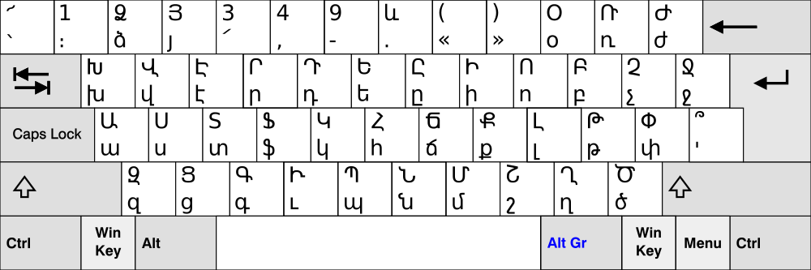

# Vim Armenian Keymaps

This is a set of Vim keymaps for the Armenian alphabet. The keymaps can be used
to type Armenian characters in Insert mode while retaining standard
functionality in Normal mode.

The `master` branch provides a pair of common mappings for the Western and
Eastern dialects that cover the full alphabet and all standard punctuation
marks. These are included in the [Vim source code][]. The `alt` branch provides
an alternate set of mappings based on the xkeyboard-config Armenian keymaps.

Please feel free to submit additional keymaps or corrections as pull requests
or patches sent to <vim@benlinskey.com>.

## Setup

### Installing the keymap files

The keymaps on the `master` branch are included with Vim, so you can skip ahead
to [Activating a keymap](#activating-a-keymap) if you’re using a newer version
of Vim and you don’t need one of the alternate keymaps from the `alt` branch.

If the keymap file you want to use isn’t installed on your system, copy or link
the file to your Vim keymap directory (`/usr/share/vim/vim74/keymap` by default
in Vim 7.4).

### Activating a keymap

To use a keymap, you’ll need to enable it in your `.vimrc` using the `keymap`
option. For example, to use the Western Armenian keymap, copy or link
`armenian-western_utf-8.vim` to the directory `/usr/share/vim/vim74/keymap/`,
then enable the keymap in your `.vimrc`:

```vim
set keymap=armenian-western_utf-8
```

You can switch between Armenian and Latin characters in Insert mode using
<kbd>Ctrl-^</kbd>. To disable the keymap at Vim startup so that Insert mode
uses Latin characters by default, add the following lines to your `.vimrc`:

```vim
set iminsert=0
set imsearch=0
```

For more information on keymaps, see `:help mbyte-keymap`.

## Layouts

### Eastern Armenian


*The original uploader was Pokajanje at English Wikipedia. (Transferred from
en.wikipedia to Commons.) [[CC BY-SA 3.0][]],
[via Wikimedia Commons](https://commons.wikimedia.org/wiki/File%3AKB_Eastern_Armenian.svg).*

### Western Armenian



*The original uploader was Pokajanje at English Wikipedia. (Transferred from
en.wikipedia to Commons.) [[CC BY-SA 3.0][]],
[via Wikimedia Commons](https://commons.wikimedia.org/wiki/File%3AKB_Western_Armenian.svg).*

[Vim source code]: https://github.com/vim/vim
[CC BY-SA 3.0]: http://creativecommons.org/licenses/by-sa/3.0
